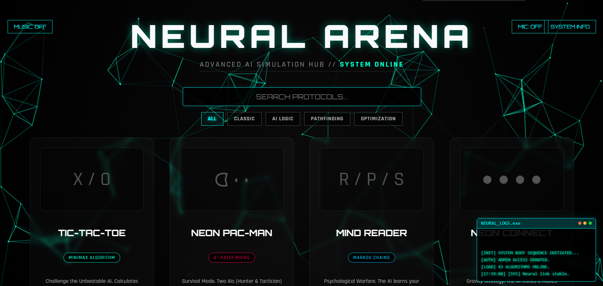

# 🧠 Deepak.Neural() | AI Engineer Portfolio

[](https://D0027.github.io/YOUR_REPO_NAME/)
[](https://github.com/D0027)

> **"Architecting the future with code. Specialized in Deep Learning models, Computer Vision, and scalable Web Architectures."**


*(Note: Replace the image above with a screenshot of your portfolio home page)*

## 🌐 About The Project

This is my personal portfolio website, designed to showcase my journey as an **AI Engineer** and **Full Stack Developer**. 

It is built with a **"Neural" design philosophy**—clean, futuristic, and responsive. The site features advanced scroll animations, glassmorphism UI elements, and a fully functional contact system without a backend server.

### ✨ Key Features
* **Futuristic UI:** "Glass Control Panel" aesthetic with Dark Navy & Neon accents.
* **Smooth Animations:** Integrated `AOS` (Animate On Scroll) for premium reveal effects.
* **Interactive Elements:**
    * Liquid "Chat" Button.
    * Holographic AI Core Animation.
    * Auto-filling Skill Progress Bars.
    * Floating 3D Timeline Icons.
* **Responsive Design:** Fully optimized for Mobile, Tablet, and Desktop (Bootstrap 5).
* **Functional Contact Form:** powered by Formspree (AJAX integrated).

---

## 🛠️ Tech Stack

Built with performance and aesthetics in mind.

| Tech | Usage |
| :--- | :--- |
|  | Structure & Semantic Markup |
|  | Styling, Gradients, Glassmorphism |
|  | Responsive Grid System |
|  | Logic, Form Handling, DOM Manipulation |
| **AOS Library** | Advanced Scroll Animations |
| **FontAwesome** | Professional Icons |

---

## 🚀 Deployment

This project is optimized for **GitHub Pages**.

1.  Clone the repo:
    ```bash
    git clone [https://github.com/D0027/YOUR_REPO_NAME.git](https://github.com/D0027/YOUR_REPO_NAME.git)
    ```
2.  Open `index.html` in your browser to test locally.
3.  Push to GitHub and enable **GitHub Pages** in Settings.

---

## 📂 Project Structure

├── index.html # Main HTML structure ├── style.css # Custom CSS (Glassmorphism, Animations) ├── script.js # Logic for Scroll & Formspree ├── deepak.png # Profile Image ├── deepak-ai.png # Project Screenshot ├── resume.pdf # Downloadable CV └── README.md # Documentation

---

## 📬 Contact Protocol

If you have a project in mind or want to discuss the latest in AI, send a signal.

* **Email:** [dy0169489@gmail.com](mailto:dy0169489@gmail.com)
* **LinkedIn:** [linkedin.com/in/deepakyadav027](https://www.linkedin.com/in/deepakyadav027)
* **GitHub:** [github.com/D0027](https://github.com/D0027)
* **Live AI Project:** [deepakai.pythonanywhere.com](http://deepakai.pythonanywhere.com/)

---

<p align="center">
  &copy; 2026 Deepak Yadav. Engineered with ❤️ & Intelligence.
</p>
