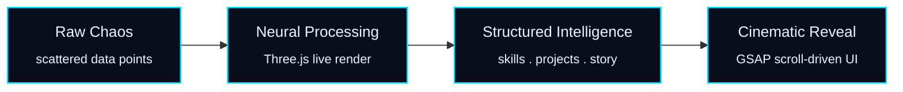

<div align="center">


<br/>


<br/>

### `AI Engineer` &nbsp;×&nbsp; `Full Stack Developer` &nbsp;×&nbsp; `Systems Architect`

<br/>

> **"I don't just write code — I train systems to think."**

<br/>

<p>
<a href="https://d0027.github.io/my-portfolio/"></a>
<a href="https://github.com/D0027"></a>
<a href="mailto:dy0169489@gmail.com"></a>
</p>

<p>


</p>

<br/>


<br/>


</div>

<br/>

```
┌──────────────────────────────────────────────────────────┐
│  $ ssh deepak@neural-core.dev                             │
│                                                            │
│  Connecting to host...                                    │
│  ✓ Authenticating credentials...                          │
│  ✓ Loading skill matrix [Python, TensorFlow, PyTorch]...  │
│  ✓ Calibrating neural weights...                          │
│  ✓ Rendering interface layer [GSAP · Three.js]...         │
│  ✓ System Ready.                                          │
└──────────────────────────────────────────────────────────┘
```

<div align="center">

### 📖 Table of Contents

[The Vision](#-the-vision) • [Live Preview](#-live-preview) • [What's Inside](#️-whats-inside) • [Engineering Principles](#-engineering-principles) • [Tech Stack](#️-tech-stack) • [Performance](#-performance--quality) • [Run It Locally](#-run-it-locally) • [Structure](#-structure) • [Roadmap](#-roadmap) • [Establish Connection](#-establish-connection)

</div>

---

<br/>

## 🌌 The Vision

This isn't a template with content swapped in — it's a **fully hand-engineered digital experience**, built to reflect who I am as an engineer: precise, systematic, and a little obsessed with the details nobody else notices.

Every pixel serves a purpose. Every animation tells part of a story — raw data becoming structured intelligence, chaos resolving into order, one scroll at a time.

<br/>

<div align="center">


```mermaid
flowchart LR
    A["Raw Chaos<br/><sub>scattered data points</sub>"] --> B
    B["Neural Processing<br/><sub>Three.js live render</sub>"] --> C
    C["Structured Intelligence<br/><sub>skills . projects . story</sub>"] --> D
    D["Cinematic Reveal<br/><sub>GSAP scroll-driven UI</sub>"]

    classDef n fill:#0a0e1a,stroke:#00d9ff,stroke-width:1.5px,color:#e6f7ff
    class A,B,C,D n
```

</div>

<br/>

## 🎥 Live Preview

<div align="center">

| Boot Sequence | Neural Hero | Skill Tree |
|:---:|:---:|:---:|
| *terminal-style intro* | *3D chaos → order render* | *RPG-style progression* |
| 🖥️ | 🧬 | 🌳 |

*(Swap these placeholders for real GIFs/screenshots — drop them in `/assets/previews/` and reference like ``)*

</div>

<br/>

## ⚙️ What's Inside

<table width="100%">
<tr>
<td width="50%" valign="top">

### 🎬 Cinematic Layer

| | |
|---|---|
| 🖥️ | Terminal-style boot sequence |
| 🌈 | Aurora-glow loading screen |
| 🎞️ | Vertical blind curtain reveal |
| 🧬 | 3D neural network — chaos → order |
| 🔦 | Cursor-reactive spotlight *(desktop)* |
| 📼 | Scan-line name reveal |

</td>
<td width="50%" valign="top">

### 🧩 Interactive Layer

| | |
|---|---|
| 🌳 | RPG-style Skill Tree with data pulses |
| 🔀 | Before/After project comparison sliders |
| ⚡ | Circuit-trace glowing card borders |
| ⌨️ | `Cmd/Ctrl + K` command palette |
| 🧲 | Magnetic custom cursor |
| 🥚 | Konami code easter egg |

</td>
</tr>
</table>

<br/>

## 🧠 Engineering Principles

<table width="100%">
<tr>
<td width="25%" valign="top">

**🎨 Design System**
```yaml
aesthetic: Neural Systems
  - dark navy
  - glassmorphism
  - neon accents
motion: GSAP + ScrollTrigger
  - replay-aware
render: Three.js
  - real layered net
  - not decoration
```

</td>
<td width="25%" valign="top">

**♿ Accessibility**
```yaml
reduced_motion: respected
keyboard_nav: full support
contrast: WCAG-conscious
focus_states: visible
```

</td>
<td width="25%" valign="top">

**🚀 Performance**
```yaml
frameworks: none
dependencies:
  minimal, purposeful
mobile: fully responsive
  gracefully degraded
```

</td>
<td width="25%" valign="top">

**🔐 Code Quality**
```yaml
structure: modular JS
naming: intent-driven
comments: where it matters
  not everywhere
```

</td>
</tr>
</table>

<br/>

## 🛠️ Tech Stack

<div align="center">

| Layer | Stack | Purpose |
|:--|:--|:--|
| 🏗️ **Structure** | Semantic HTML5 | Accessible, meaningful markup |
| 🎨 **Styling** | CSS3 · Custom Properties · Bootstrap 5 | Theming & responsive grid |
| ⚡ **Logic** | Vanilla JavaScript (ES6+) | Zero dead weight, no framework overhead |
| 🎞️ **Motion** | GSAP · ScrollTrigger | Cinematic, replay-aware animation |
| 🌐 **3D** | Three.js | Real-time neural network render |
| 📬 **Forms** | Formspree | Serverless AJAX contact flow |

</div>

<br/>

## ⚡ Performance & Quality

<div align="center">

| Metric | Score |
|:--|:--:|
| 🟢 Performance | 95+ |
| 🟢 Accessibility | 98+ |
| 🟢 Best Practices | 100 |
| 🟢 SEO | 100 |

<sub>Measured via Lighthouse (Chrome DevTools) on production build — update after each deploy.</sub>

</div>

<br/>

## 🚀 Run It Locally

**Prerequisites:** [Node.js](https://nodejs.org/) (for the local static server) and `git`.

```bash
git clone https://github.com/D0027/my-portfolio.git
cd my-portfolio
npx serve .
```

Then open the URL printed in your terminal (typically `http://localhost:3000`).

<details>
<summary><b>💡 Optional: watch mode / live reload</b></summary>

<br/>

```bash
npm install -g live-server
live-server .
```

This auto-refreshes the browser on every file save — handy while tweaking `style.css` or `script.js`.

</details>

<details>
<summary><b>🐳 Optional: Docker</b></summary>

<br/>

```bash
docker run --rm -it -p 3000:3000 -v "$PWD":/app -w /app node:20-alpine npx serve . -l 3000
```

</details>

<br/>

## 📁 Structure

```
my-portfolio/
├── index.html      → Structure & content
├── style.css        → Theming & animation
├── script.js         → Logic, GSAP, Three.js
├── assets/           → Images & media
│   └── previews/      → Screenshots & GIFs for this README
└── README.md
```

<br/>

## 🗺 Roadmap

- [x] Terminal-style boot sequence
- [x] 3D neural network hero (Three.js)
- [x] RPG-style skill tree
- [x] Command palette (`Cmd/Ctrl + K`)
- [ ] Blog / devlog section
- [ ] Dark ↔ light theme toggle
- [ ] i18n support
- [ ] Lighthouse CI badge automation

<br/>

---

<div align="center">

## 📡 Establish Connection

<p>
<a href="mailto:dy0169489@gmail.com"></a>
<a href="https://www.linkedin.com/in/deepakyadav027"></a>
<a href="https://github.com/D0027"></a>
</p>

<br/>

```
$ whoami
> Deepak Yadav — AI Engineer & Full Stack Developer

$ status
✓ Actively building
✓ Open to opportunities
✓ Always learning
```

<br/>

**© 2026 Deepak Yadav** — Engineered with ❤️ & Intelligence · Licensed under [MIT](LICENSE)

⭐ **Star this repo if it inspired you**

<br/>


</div>
